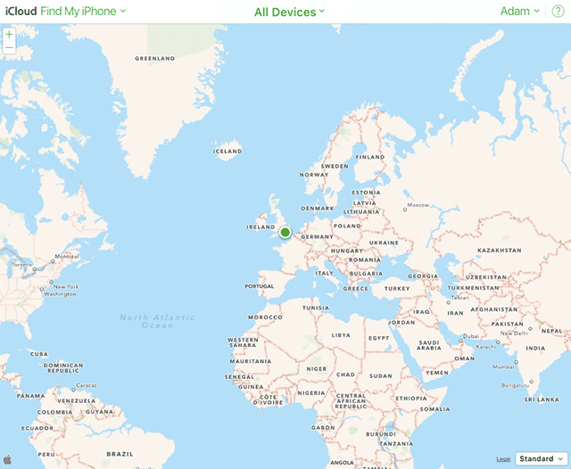

# Research

*Geolocation Services* is broad term for the collection of technologies used to determine a smartphone's geographic location. The four primary technologies used for geolocation services are (1) GPS, (2) cellular triangulation, (3) Bluetooth, and (4) WiFi positioning. Depending on which of these 4 signals are available, a smartphone will attempt to determine its geographic location with the highest accuracy and shortest wait time.

SkyLift makes use of an *exploit* with WiFi geolocation services that was first discovered in 2008 by Swiss researcher [Srdjan Capkun](http://www.ethlife.ethz.ch/archive_articles/080417_WiFi_location_spoofing/index_EN.html) at ETH Zurich showing. Despite their early warning in 2008, all major smartphone companies have continued to integrate Wi-Fi as a core geolocation technology. The vulnerability still existed in 2012 when Bengt Sjölen and Gordan Savicic creatively exploited it for their 2012 project [Packetbridge](https://criticalengineering.org/projects/packetbridge/).

The vulnerability is difficult to deal with because Wi-Fi geolocation companies assume everyone's WiFi router, including the one inside your home, is part of a their commercial geolocation product. Whether or not this is legal or ethical should be more openly debated. 

Already proven in 2008 is that smartphone geolocation data can be easily falsified and should not be trusted. Yet we rely on this technology for an increasing number of critical applications from the timestamps on IoT devices that use automatically set timezones to applications like *FindMyPhone* that track a lost/stolen phone. 

The image below shows how easily I was able to trick Apple's Find my Phone service into thinking my device was at the Ecuadorian Embassy in London. (Image made with device actually in Berlin, works with Desktop or mobile device).

## Additional Reading

- [Beacon Frame Overview](https://en.wikipedia.org/wiki/Beacon_frame)
- [Beacon Frame Packet](https://mrncciew.com/2014/10/08/802-11-mgmt-beacon-frame/) in more depth
- [Spoofing WiFi Geolocation services](http://www.senet-int.com/2013/12/wi-fi-geo-location/) on Hackaday
- [Don't Trust Geolocation](http://www.journaldulapin.com/2013/08/26/dont-trust-geolocation/)
- [Device-to-Identity Linking Attack Using Targeted Wi-Fi Geolocation Spoofing](https://hal.inria.fr/hal-01176842/document)
- <http://www.rfwireless-world.com/Terminology/WLAN-beacon-frame.html>
- <http://www.rfwireless-world.com/Articles/WLAN-MAC-layer-protocol.html>
- <http://www.sharetechnote.com/html/WLAN_Beacon.html>
- <http://www.sharetechnote.com/html/WLAN_FrameStructure.html#MAC_Header_Ex_01>
- <https://www.saltwaterc.eu/forging-an-802-11-beacon-frame.html>
- <http://www.zytrax.com/tech/wireless/802_mac.htm>
- <https://witestlab.poly.edu/blog/802-11-wireless-lan-2/>
- <https://mrncciew.com/2014/10/08/802-11-mgmt-beacon-frame/>
- <https://en.wikipedia.org/wiki/List_of_WLAN_channels>
- Japan: 12, 13, 14. Most of world is: 12, 13. US is only 1 - 11
